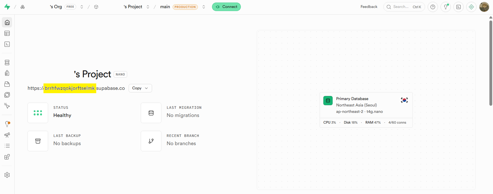

# Coin Shop 사용 가이드

학생 포인트 적립, 상점 구매, 관리자용 학생/상품/가맹점/PIN/공지 관리를 제공하는 Next.js + Supabase 프로젝트입니다.

이 문서는 실제 사용/운영을 위한 상세 가이드입니다. 프로젝트 소개, 빠른 실행, 배포 요약은 `README.md`를 먼저 확인하세요.

## 빠른 실행

```powershell
npm install
npm run dev
```

브라우저에서 아래 주소로 접속합니다.

```text
http://localhost:3000
```

## 필수 환경변수

`.env` 또는 Vercel 환경변수에 아래 값을 설정합니다.

| 변수명 | 용도 | 노출 여부 |
| --- | --- | --- |
| `NEXT_PUBLIC_SUPABASE_URL` | Supabase 프로젝트 URL | 브라우저 노출 가능 |
| `NEXT_PUBLIC_SUPABASE_ANON_KEY` | Supabase anon key | 브라우저 노출 가능 |
| `SUPABASE_SERVICE_ROLE_KEY` | 서버 API에서 DB 관리 작업 수행 | 절대 브라우저 노출 금지 |

예시는 `.env.sample`을 참고합니다.

## 화면 구성

| 경로 | 사용자 | 설명 |
| --- | --- | --- |
| `/lobby` | 학생 | 학부모 연락처 뒷자리로 학생 입장 |
| `/dashboard` | 학생 | 마이페이지, 상점 입장 |
| `/admin` | 관리자 | 관리자 로그인, 회원가입, 관리 기능 |

## 학생 사용 흐름

1. `/lobby` 접속
2. 학부모 연락처 뒷자리 8자리 입력
3. 같은 연락처로 등록된 학생이 여러 명이면 학생 선택
4. `/dashboard` 입장
5. 왼쪽 메뉴에서 `마이페이지` 또는 `상점 입장` 선택

### 마이페이지

- 기본 정보: 이름, 현재 포인트, 등록일
- 포인트 내역: 날짜, 사유, 증감 DP
- 구매 내역: 날짜, 상품명, 사용 DP

### 상점 입장

- 현재 포인트 확인
- 카테고리 필터: 전체, 3D프린터, 간식류, 문구류
- 상품 클릭 후 팝업에서 구매
- 구매 시 학생 포인트 차감, 상품 재고 차감, 구매/포인트 내역 저장

## 관리자 역할

| 역할 | 접근 가능 기능 |
| --- | --- |
| `master` | 전체 가맹점 학생 관리, 상점 관리, 가맹점 관리, PIN 관리, 공지 관리 |
| `manager` | 본인 가맹점 학생 관리, 상점 관리, 가맹점 관리 조회 |
| `staff` | 학생 관리 중 포인트 조정 중심 |

## 관리자 사용 흐름

1. `/lobby` 우측 상단 `관리자` 클릭
2. `/admin`에서 관리자 아이디와 비밀번호로 로그인
3. 아이디는 내부적으로 `@daddyslab.com`이 붙어 이메일 형식으로 로그인됩니다.

예시:

```text
입력 ID: kyle
실제 로그인 이메일: kyle@daddyslab.com
```

### 관리자 회원가입

1. `/admin`에서 `회원가입` 선택
2. 관리자 이름, ID, 비밀번호, 가맹점, 가입 PIN 입력
3. 가입 후 권한은 기본 `staff`로 생성됩니다.
4. 권한 변경이 필요하면 Supabase DB에서 `admin_profiles.role`을 조정합니다.

## 주요 관리 기능

| 메뉴 | 설명 |
| --- | --- |
| 학생 관리 | 학생 검색, 개별 추가, 엑셀 업로드, 학생 삭제, 포인트 조정 |
| 상점 관리 | 상품 목록 확인 |
| 가맹점 관리 | 가맹점별 학생/강사/포인트 요약 확인, master는 가맹점 추가/삭제 |
| PIN 관리 | master가 가맹점별 관리자 가입 PIN 생성, 수정, 복사 |
| 공지 관리 | master가 공지 작성, 수정, 삭제 |

## 상품 운영 기준

학생 상점에서 기본으로 사용하는 카테고리는 아래와 같습니다.

```text
전체, 3D프린터, 간식류, 문구류
```

`전체`는 화면 필터용 값이므로 DB `products.category`에는 실제 상품 분류인 `3D프린터`, `간식류`, `문구류` 등을 저장합니다.

상품 구매 시 아래 데이터가 함께 변경됩니다.

| 대상 | 변경 내용 |
| --- | --- |
| `students.points` | 상품 가격만큼 차감 |
| `products.stock` | 1개 차감 |
| `purchases` | 구매 내역 추가 |
| `point_transactions` | `transaction_type = purchase` 내역 추가 |

## 엑셀 업로드 형식

학생 관리에서 엑셀 업로드 시 아래 컬럼을 인식합니다.

| 엑셀 컬럼 | DB 반영 |
| --- | --- |
| `No` | 무시 |
| `성명` | 학생 이름 |
| `부모HP(모)` | 학부모 연락처 |
| `학년` | 학생 학년 |

지원 학년:

```text
3세, 4세, 5세, 6세, 7세,
초1, 초2, 초3, 초4, 초5, 초6,
중1, 중2, 중3,
고1, 고2, 고3,
성인
```

`2학년`처럼 들어온 값은 `초2` 형태로 변환됩니다.

## 주요 API Route

| API | Method | 설명 |
| --- | --- | --- |
| `/api/student/login` | `POST` | 학부모 연락처로 학생 조회 |
| `/api/student/profile` | `GET` | 학생 기본 정보 조회 |
| `/api/student/activity` | `GET` | 학생 포인트/구매 내역 조회 |
| `/api/student/products` | `GET` | 학생 가맹점 상품 조회 |
| `/api/student/purchases` | `POST` | 상품 구매 처리 |
| `/api/admin/students` | `POST`, `DELETE` | 학생 추가, 비활성화 |
| `/api/admin/departments` | `POST`, `DELETE` | 가맹점 추가, 비활성화 |
| `/api/admin/pins` | `GET`, `POST` | 가맹점별 가입 PIN 조회/저장 |
| `/api/admin/franchises/summary` | `GET` | 가맹점 요약 조회 |
| `/api/admin/announcements` | `GET`, `POST`, `PATCH`, `DELETE` | 공지 조회/작성/수정/삭제 |

## 주요 DB 테이블

| 테이블 | 설명 |
| --- | --- |
| `departments` | 가맹점 |
| `admin_profiles` | 관리자 프로필, 역할, 소속 가맹점 |
| `admin_settings` | 가맹점 가입 PIN 등 설정 |
| `students` | 학생, 학부모 연락처, 학년, 포인트, 담당 강사 |
| `products` | 상점 상품, 가격, 재고, 카테고리 |
| `purchases` | 학생 상품 구매 내역 |
| `point_transactions` | 포인트 증감 이력 |
| `announcements` | 공지사항 |

## Master 계정 준비

최초 master 관리자는 Supabase Auth 계정과 `admin_profiles` 데이터가 함께 필요합니다.

1. Supabase Dashboard에서 Auth user 생성
2. 로그인 이메일은 앱 입력 ID에 `@daddyslab.com`을 붙인 형식으로 맞춤
3. `admin_profiles.auth_user_id`가 해당 Auth user의 ID를 참조해야 함
4. `admin_profiles.role`은 `master`로 설정
5. `admin_profiles.department_id`는 존재하는 가맹점 ID를 참조해야 함

예시:

```text
관리자 입력 ID: kyle
Supabase Auth email: kyle@daddyslab.com
admin_profiles.login_id: kyle
admin_profiles.role: master
```

## 관리자 비밀번호 재설정

관리자 계정은 실제 이메일 수신을 전제로 하지 않습니다.
비밀번호를 잊은 매니저/스태프는 마스터가 `/admin`의 가맹점 관리 화면에서 해당 강사를 선택한 뒤 새 비밀번호로 변경합니다.
마스터 계정 비밀번호를 잊은 경우에는 Supabase Dashboard의 Authentication에서 직접 재설정합니다.

## Supabase 연결

Supabase CLI 로그인:

```powershell
npx supabase login
```

Supabase Dashboard에서 프로젝트 ref를 확인합니다.



프로젝트 연결:

```powershell
npx supabase link --project-ref YOUR_PROJECT_REF
```

## Migration 작업

마이그레이션 폴더가 없으면 생성합니다.

```powershell
New-Item -ItemType Directory -Force supabase\migrations
```

새 migration 생성:

```powershell
npx supabase migration new migration_name
```

작성한 스키마 파일을 migration으로 복사할 때:

```powershell
Copy-Item supabase\schema.sql supabase\migrations\파일명.sql
```

적용 전 확인:

```powershell
npx supabase db push --dry-run
```

실제 DB 반영:

```powershell
npx supabase db push
```

주의:

- 이미 원격 DB에 반영된 migration 파일은 삭제하거나 수정하지 않습니다.
- 변경이 필요하면 새 migration 파일을 추가합니다.
- `schema.sql`을 바꿨다면 그 변경을 migration에도 반영해야 실제 Supabase DB에 적용됩니다.

## 배포 준비

배포 전 로컬 검증:

```powershell
npm run lint
npx tsc --noEmit
npm run build
```

## Vercel 배포

이 프로젝트는 별도 Django/Express 서버 없이 Vercel + Supabase로 배포할 수 있습니다.

1. Vercel에서 GitHub 저장소 Import
2. Framework Preset: `Next.js`
3. Environment Variables에 필수 환경변수 3개 등록
4. Deploy 실행

Vercel 환경변수:

```env
NEXT_PUBLIC_SUPABASE_URL=
NEXT_PUBLIC_SUPABASE_ANON_KEY=
SUPABASE_SERVICE_ROLE_KEY=
```

Supabase Auth URL 설정:

```text
Authentication → URL Configuration
```

Vercel 도메인을 추가합니다.

```text
https://your-project.vercel.app
```

커스텀 도메인을 붙이면 해당 도메인도 추가합니다.

## 운영 체크리스트

- Supabase Auth에 master 관리자 계정이 존재하는지 확인
- `admin_profiles`에 master 프로필이 연결되어 있는지 확인
- 가맹점 데이터가 존재하는지 확인
- 가맹점별 PIN이 필요한 경우 `PIN 관리`에서 생성
- 학생 데이터의 `department_id`가 올바른지 확인
- 학생 데이터의 `teacher_id`가 담당 강사와 연결되어 있는지 확인
- 상품 데이터의 `department_id`, `category`, `price_dp`, `stock`이 올바른지 확인
- 상품 구매 테스트 후 `students`, `products`, `purchases`, `point_transactions`가 함께 반영되는지 확인
- Vercel에 `SUPABASE_SERVICE_ROLE_KEY`가 등록되어 있고 클라이언트 코드에 노출되지 않는지 확인
